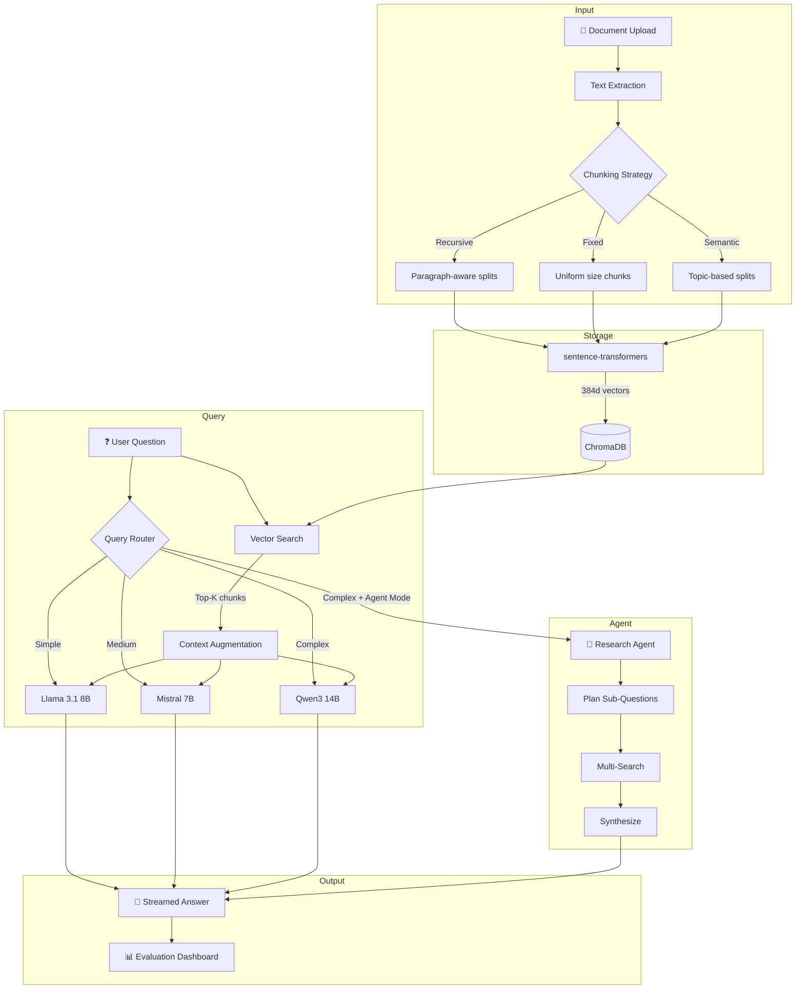

# 🧠 AI Knowledge Hub

**Intelligent Document Analysis Platform with Custom RAG Pipeline, Multi-Model Routing & Autonomous Agent Mode**

[](https://python.org)
[](https://streamlit.io)
[](https://www.trychroma.com)
[](LICENSE)

> Upload any document, ask questions, and get AI-powered answers grounded in your data — with full transparency into how the system thinks.

---

## ✨ Key Features

| Feature | Description |
|---------|-------------|
| **Custom RAG Pipeline** | Built from scratch — no LangChain. Document → Chunk → Embed → Store → Retrieve → Generate |
| **3 Chunking Strategies** | Fixed-size, Recursive (paragraph-aware), and Semantic (topic-shift detection) |
| **Local Embeddings** | sentence-transformers (all-MiniLM-L6-v2) — runs locally, no API costs |
| **Multi-Model Routing** | Automatic query complexity analysis → routes to optimal model |
| **Agent Mode** | Autonomous research agent that decomposes complex questions into sub-queries |
| **Evaluation Dashboard** | Real-time retrieval quality metrics, latency tracking, model distribution |
| **Source Citations** | Every answer references which documents it's based on |
| **Streaming Responses** | Real-time token streaming for instant feedback |

---

## 🏗️ Architecture



---

## 📁 Project Structure

```
ai-knowledge-hub/
├── app.py                  # Streamlit entry point + full UI
├── config.py               # Central configuration (models, params)
├── requirements.txt
│
├── rag/                    # Custom RAG pipeline (no LangChain)
│   ├── loader.py           # PDF, TXT, MD, DOCX text extraction
│   ├── chunker.py          # 3 strategies: fixed, recursive, semantic
│   ├── embeddings.py       # sentence-transformers (MiniLM-L6-v2)
│   ├── vectorstore.py      # ChromaDB wrapper with CRUD operations
│   └── pipeline.py         # Full RAG orchestration
│
├── agents/                 # Intelligent query handling
│   ├── router.py           # Query complexity → model selection
│   ├── researcher.py       # Multi-step research agent
│   └── tools.py            # Agent tools (search, compare, summarize)
│
├── evaluation/             # Quality measurement
│   ├── metrics.py          # Retrieval precision, answer relevance
│   └── tracker.py          # Latency, cost, performance tracking
│
├── prompts/                # Prompt engineering
│   ├── system.py           # System prompts
│   ├── rag.py              # RAG context templates
│   └── agent.py            # Planning & synthesis prompts
│
├── ui/                     # UI layer
│   ├── styles.py           # Custom dark theme CSS
│   └── components.py       # Reusable UI widgets
│
└── tests/                  # Test suite (34 tests)
    ├── test_chunker.py     # 17 tests for chunking strategies
    ├── test_embeddings.py  # 7 tests for embedding engine
    └── test_retriever.py   # 10 tests for vector store
```

---

## 🚀 Quick Start

### 1. Clone & Install

```bash
git clone https://github.com/redyinn/ai-knowledge-hub.git
cd ai-knowledge-hub
pip install -r requirements.txt
```

### 2. Configure API Key

Get a free API key from [OpenRouter](https://openrouter.ai/) and set it:

```bash
# Option A: Environment variable
export OPENROUTER_API_KEY="your-key-here"

# Option B: .env file
echo 'OPENROUTER_API_KEY=your-key-here' > .env

# Option C: Enter in the app sidebar
```

### 3. Run

```bash
streamlit run app.py
```

### 4. Run Tests

```bash
pytest tests/ -v
```

---

## 🔧 Technical Deep-Dive

### Chunking Strategies

| Strategy | How it works | Best for |
|----------|-------------|----------|
| **Recursive** | Splits by paragraphs → sentences → words, preserving structure | Most documents (default) |
| **Fixed-Size** | Uniform character chunks with configurable overlap | Uniform text (articles) |
| **Semantic** | Detects topic shifts via embedding similarity | Multi-topic documents |

### Query Routing

The router analyzes each query using heuristic scoring:
- **Word count** — longer queries tend to be more complex
- **Pattern matching** — keywords like "compare", "analyze", "implications" indicate complexity
- **Multi-question detection** — multiple question marks suggest compound queries

```
"What is Python?"           → simple  → Llama 3.1 8B (fast)
"Summarize the key points"  → medium  → Mistral 7B (balanced)
"Compare X and Y, analyze   → complex → Qwen3 14B (powerful)
 implications for Z"
```

### Agent Mode

For complex questions, the Research Agent:
1. **Plans** — Uses LLM to decompose into 2-5 sub-questions
2. **Researches** — Runs vector searches for each sub-question
3. **Synthesizes** — Combines findings into a comprehensive answer

Each step is visible in the UI, showing the agent's reasoning process.

---

## 📊 Evaluation Dashboard

Real-time metrics tracked for every query:
- **Retrieval Quality** — avg/max/min relevance scores, source diversity
- **Latency** — end-to-end response time per query
- **Model Distribution** — which models handle which queries
- **Query History** — full log with complexity classification

---

## 🛠 Tech Stack

| Component | Technology | Why |
|-----------|-----------|-----|
| Frontend | Streamlit | Rapid prototyping with rich widgets |
| Vector DB | ChromaDB | Local, fast, no cloud dependency |
| Embeddings | sentence-transformers | Free, local, 384d vectors |
| LLMs | OpenRouter (free tier) | Multi-model access, zero cost |
| PDF Parsing | PyPDF2 | Reliable text extraction |
| Testing | pytest | 34 tests covering core logic |

---

## 📄 License

MIT License — see [LICENSE](LICENSE) for details.

---

**Built by [Ertugrul Korkmaz](https://github.com/redyinn)** — Custom RAG implementation, no LangChain wrapper.
